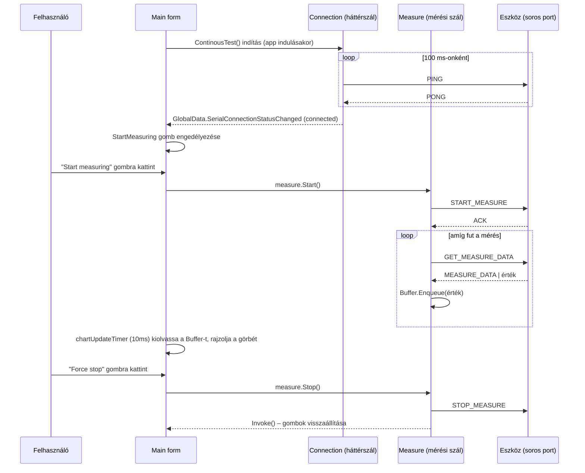

# Vascular Pressure Measurement System – Projektdokumentáció

> C# Windows Forms alkalmazás vaszkuláris (ér-) nyomás mérésére, egy soros porton (USB/UART)
> kapcsolódó mikrovezérlős (Arduino-szerű) hardver segítségével.

Ez a dokumentáció a teljes forráskódot végigveszi: bemutatja az alkalmazás felépítését,
a soros kommunikációs protokollt, majd fájlonként/osztályonként, **metódus szinten** leírja,
hogy az egyes részek mit és hogyan csinálnak.

## Tartalomjegyzék / a dokumentáció fájljai

| Fájl | Tartalom |
|---|---|
| `README.md` | Ez a fájl – áttekintés, architektúra, kommunikációs protokoll, gyors referenciák |
| `Utils.md` | `Utils` névtér: `Connection`, `Measure`, `GlobalData`, `Trace` – a mérőrendszer "motorja" |
| `Configuration.md` | `Configuration` névtér: `Hardware`, `Application` – paraméterek kezelése |
| `Main_form.md` | A `Main` főablak – a program szíve, a felhasználói felület vezérlése |
| `Forms.md` | `SettingsForm`, `Diagnostics`, `AnalysisForm`, `AboutForm` – kiegészítő ablakok |

---

## 1. Mit csinál az alkalmazás?

A program egy asztali (WinForms) kliens, amely:

1. **automatikusan felkutatja és fenntartja a kapcsolatot** egy soros porton csatlakoztatott
   mérőeszközzel (folyamatos "PING/PONG" ellenőrzéssel, háttérszálon),
2. **valós idejű nyomásgörbét** jelenít meg (`Chart` vezérlő) mérés közben,
3. a mért adatsort **CSV fájlba menti**, illetve korábbi mérést **CSV-ből visszatölt**,
4. a felhasználó a görbén **egérrel kijelölhet egy szakaszt**, amelyre az alkalmazás
   **numerikus deriváltat** (meredekséget) számol, és egy külön ablakban (`AnalysisForm`)
   statisztikákat (átlag, max. emelkedés/esés, ezek helye) mutat,
5. lehetővé teszi a mérési **hardverparaméterek** (`MIN_DELTA`, `FALL_THRESHOLD`) módosítását
   (`SettingsForm`), amelyeket egyszerre ment fájlba és tölt fel az eszközre,
6. rejlett **diagnosztikai/teszt módot** biztosít (`Diagnostics` ablak, `Ctrl+Shift+D`),
   amelyben az eszköz digitális/analóg lábainak (pin) állapota közvetlenül vizsgálható
   és (kimenet esetén) állítható.

## 2. Architektúra

### 2.1 Névterek és rétegek

```
Vascular_Pressure_Measurement_System                (gyökér – Main form)
├── .Forms                                           (ablakok / UI)
│   ├── SettingsForm      – hardverparaméterek szerkesztése
│   ├── Diagnostics        – I/O lábak élő tesztelése
│   ├── AnalysisForm        – kijelölt szakasz derivált-elemzése
│   └── AboutForm            – verzióinfó
├── .Utils                                          (motor / infrastruktúra)
│   ├── Connection          – soros port kezelése, üzenetprotokoll, automatikus újracsatlakozás
│   ├── Measure              – mérési ciklus külön szálon, adat puffer
│   ├── GlobalData             – globális állapot + esemény (kapcsolat státusza)
│   └── Trace                    – egyszerű fájl alapú naplózás
└── .Configuration                                  (beállítások)
    ├── Hardware              – hardverparaméterek fájlba/eszközre írása-olvasása
    └── Application            – jelenleg üres, jövőbeli app-szintű beállításokhoz (TODO váz)
```

A `Main` form nincs külön névtérben (`Vascular_Pressure_Measurement_System` gyökér névtér),
minden más ablak a `Forms` alnévtérben van.

### 2.2 Felelősségi rétegek

| Réteg | Feladat | Fő osztályok |
|---|---|---|
| **UI (Forms)** | Megjelenítés, felhasználói interakció, gombok/billentyűparancsok | `Main`, `SettingsForm`, `Diagnostics`, `AnalysisForm`, `AboutForm` |
| **Üzleti logika / mérés** | Mérési ciklus vezérlése, adatgyűjtés | `Measure` |
| **Kommunikáció** | Soros port keresése, nyitása, üzenetváltás, hibakezelés, automatikus reconnect | `Connection` |
| **Konfiguráció** | Hardverparaméterek perzisztálása (fájl + eszköz) | `Hardware`, `Application` |
| **Infrastruktúra** | Globális, szálbiztos állapot-megosztás, naplózás | `GlobalData`, `Trace` |

### 2.3 Szálmodell (fontos!)

Az alkalmazás tudatosan több háttérszálat használ, mindig a **UI-szálra visszaütemezve**
(`Control.Invoke`) frissíti a felületet. A soros porthoz való hozzáférést egyetlen közös
zárral (`Connection._serialPortLock`) védik, hogy két szál (pl. a folyamatos PING-teszt és
egy aktív mérés) sose írjon/olvasson egyszerre a porton:

| Szál | Indítja | Feladat | Zár |
|---|---|---|---|
| Kapcsolat-figyelő szál | `Connection.ContinousTest()` (a `Main` konstruktorában) | Port keresés, PING/PONG ellenőrzés 100 ms-onként, automatikus reconnect | `_serialPortLock` |
| Mérési szál | `Measure.Start()` | `GET_MEASURE_DATA` küldése ciklusban, adat pufferelése | `_serialPortLock` (a **teljes mérés idejére** lefoglalva!) |
| Diagnosztika poll szál | `Diagnostics.RefreshMembers()` | I/O lábak folyamatos lekérdezése | `_serialPortLock` (a `SendMessage` belső zárján keresztül) |
| UI-értesítő szálak | pl. `Main.GlobalData_SerialConnectionStatus` hiba ága | `MessageBox.Show` megjelenítése kapcsolatvesztéskor | – |

> **Fontos következmény:** amíg egy mérés fut, a `Measure` a teljes mérés idejére
> zárolva tartja a soros portot, így a háttérben futó PING-ellenőrző szál eközben nem
> tud beavatkozni – ez szándékos, hogy a mérési adatfolyamot ne szakítsa meg egy PING.

Részletek: [`Utils`](https://github.com/Snewkovits/Vascular-Pressure-Measurement-System/blob/master/Docs/Utils.md).

---

## 3. Soros kommunikációs protokoll

A PC és az eszköz **szöveges, keret alapú** protokollal kommunikál a `Connection` osztályon
keresztül.

**Port paraméterek:** 1 000 000 baud, 8 adatbit, nincs paritás, 1 stop bit, ASCII kódolás,
100 ms olvasási/írási időtúllépés.

### 3.1 Keretformátum

```
Küldött üzenet:  <ID|CMD|DATA|CHK>
Válasz üzenet:   <ID|CMD|DATA|CHK>
```

- **ID** – növekvő, egész szám számláló (minden `SendMessage`-hívás eggyel növeli); a válasznak
  ugyanezt az ID-t kell visszaadnia, különben `"ID mismatch"` hibát kapunk.
- **CMD** – a parancs neve (kérésnél a küldött parancs, válasznál pl. `ACK`, `PONG`,
  `MEASURE_DATA`, `STOP_MEASURE`, vagy a lekérdezett érték szerinti visszajelzés).
- **DATA** – a parancshoz tartozó adat (lehet üres string is).
- **CHK** – ellenőrzőösszeg: az `ID|CMD|DATA` payload karaktereinek **XOR**-a, 2 jegyű
  hexadecimális formában.

Egy tipikus üzenetváltás pl. mérés közben:

```
PC  -> Eszköz:  <42|GET_MEASURE_DATA||2A>
Eszköz -> PC:   <42|MEASURE_DATA|118.4|7F>
```

### 3.2 Parancstípusok (`Connection.CommandType`)

| Konstans | Jelentés |
|---|---|
| `PING` / `PONG` | Élőség-ellenőrzés (kapcsolat teszt) |
| `SET_PARAM` / `GET_PARAM` | Hardverparaméter írása / olvasása (`GET_PARAM` a kódban jelenleg nincs használva) |
| `START_MEASURE` / `STOP_MEASURE` | Mérés indítása / leállítása (utóbbi az eszköz felől is jöhet, pl. esésérzékeléskor) |
| `GET_MEASURE_DATA` | Egy mérési minta lekérése |
| `GET_IO` / `SET_IO` | Egy I/O láb aktuális értékének lekérdezése / beállítása |
| `GET_BOARD_DATAS` | Board típus + digitális/analóg lábszám lekérdezése |
| `GET_PIN_MODE` | Egy adott láb módjának (`INPUT`/`OUTPUT`) lekérdezése |
| `ACK` | Általános nyugtázás (pl. `START_MEASURE` sikeres indítására) |
| `ERR` | Belső (PC oldali) hibajelzés – **ezt a PC generálja**, nem az eszköz küldi a vezetéken |

### 3.3 Hibakezelés dandárja

Minden `Connection.SendMessage` hívás **soha nem dob kifelé kivételt** – hiba esetén mindig
egy `["ERR", "<üzenet>"]` tömböt ad vissza. Három egymást követő sikertelen próbálkozás után
(`faildAttempt >= 3`) a `Connection` automatikusan lezárja a portot és `isConnected = false`-ra
állítja az állapotot, amit a `GlobalData.SerialConnectionStatusChanged` esemény továbbít a
felületnek. A háttérben futó `ContinousTest` szál ezután újra elkezdi keresni az eszközt.

Részletek: [`01-Utils-Kommunikacio-Meres.md`](./01-Utils-Kommunikacio-Meres.md).

---

## 4. Fájl → felelősség gyorstáblázat

| Fájl | Osztály | Rövid leírás | Részletek |
|---|---|---|---|
| `Connection.cs` | `Connection` | Soros port keresése/nyitása, üzenetküldés-fogadás, automatikus reconnect | 01 |
| `Measure.cs` | `Measure` | Egy mérési ciklus lefolytatása külön szálon, adatpuffer | 01 |
| `GlobalData.cs` | `GlobalData` | Globális színek + kapcsolat-státusz esemény | 01 |
| `Trace.cs` | `Trace` | Egyszerű fájlba naplózás | 01 |
| `Hardware.cs` | `Hardware` | Hardverparaméterek (MIN_DELTA, FALL_THRESHOLD) fájlba/eszközre írása-olvasása | 02 |
| `Application.cs` | `Application` | Üres váz, jövőbeli alkalmazás-szintű beállításokhoz | 02 |
| `Main.cs` / `Main_Designer.cs` | `Main` | Főablak: grafikon, mérésindítás, mentés/betöltés, navigáció | 03 |
| `SettingsForm.cs` / `_Designer.cs` | `SettingsForm` | Hardverparaméterek szerkesztő ablaka | 04 |
| `Diagnostics.cs` / `_Designer.cs` | `Diagnostics` | I/O lábak élő tesztelése | 04 |
| `AnalysisForm.cs` / `_Designer.cs` | `AnalysisForm` | Kijelölt szakasz derivált-elemzése | 04 |
| `AboutForm.cs` / `_Designer.cs` | `AboutForm` | Verzióinfó | 04 |

---

## 5. Tipikus működési folyamat



---

## 6. Billentyűparancsok

| Billentyű | Hatás | Feltétel |
|---|---|---|
| `Ctrl + S` | Mérés mentése CSV-be | `SaveButton` engedélyezve van |
| `Ctrl + ,` | Beállítások megnyitása | `SettingsButton` engedélyezve van |
| `F1` | "About" ablak megnyitása | mindig |
| `Ctrl + Shift + D` | Diagnosztika ablak megnyitása (rejtett fejlesztői mód) | nincs már nyitva diagnosztika ablak, és nem fut mérés |
| `Esc` | Az adott (al)ablak bezárása | `SettingsForm`, `Diagnostics`, `AnalysisForm`, `AboutForm` mindegyikén |

---

## 7. Érdekességek / megjegyzések a kódhoz

Ezek nem hibajelentések, csupán dokumentációs megfigyelések, amelyek hasznosak lehetnek
karbantartáskor:

- **`Connection.GetSerialPort()`**: a `finally` blokk minden esetben lezárja a soros portot –
  még sikeres PONG válasz esetén is –, mielőtt a metódus visszatérne. Ez szándékos: a metódus
  csak *megkeresi* a helyes portot, a tényleges (újra)nyitást a hívó (`ContinousTest`) végzi el.
- **`Hardware.ReadConfiguration()`** a beolvasott `MIN_DELTA`/`FALL_THRESHOLD` értékeket
  `>= 0` feltétellel fogadja el, míg a `SettingsForm` mentéskor szigorúbb, `> 0` (pozitív)
  feltételt vár el a felhasználói bevitelre.
- **`Application.cs`** jelenleg funkcionálisan üres – csak egy kikommentezett tervezet van
  benne egy jövőbeli, alkalmazás-szintű konfigurációs singletonhoz.
